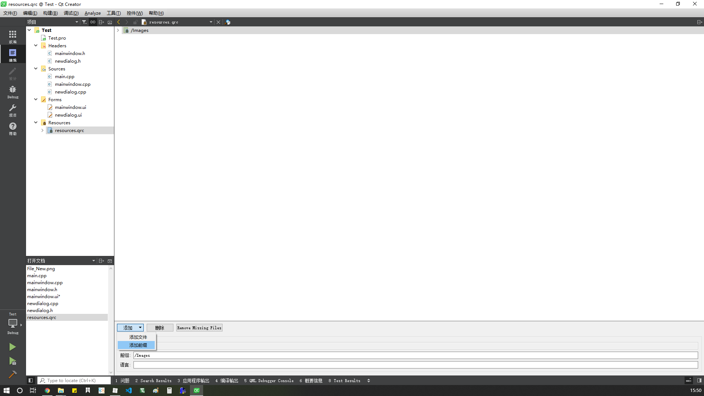
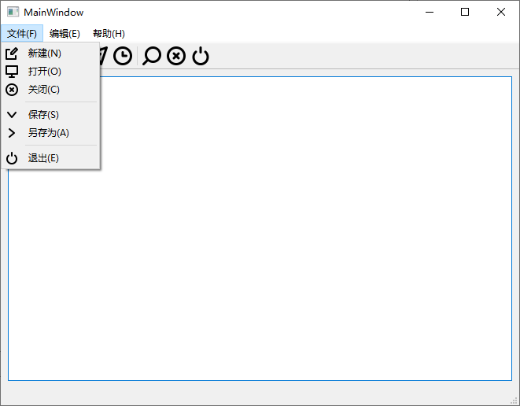

# Qt 窗口

[TOC]

## 第一个窗口


打开Qt Creater后，菜单栏在最上方， 左侧上方最常用的选项是编辑、设计和 Debug， 编辑用于编辑代码，设计用于设计界面，左侧下方分别是选择编译环境、运行、调试、构建。

**欢迎主界面**：这个界面可以打开或者新建工程，当然也可以在菜单栏上打开，然后还有示例工程和视频教程；


**编辑主界面**：这个界面用于编辑代码、文件管理；


下面新建一个工程：一般来说，需要 GUI 就选择 Widgets，否则就 Console，剩下几个是 python 以及 QML 编写的 GUI，按需选择，这里选择第一个。


设置工程名与路径；


选择用什么编译，一般是qmake或者cmake；


这里主要有三种类，QMainWindow 一般用作应用的主窗口，可以有工具栏状态栏等，QDialog 适合做弹出窗口或者简单的界面，QWidget 适合做自定义的部件也可以成为窗口，最为基本。

根据需要选择，这里先选择 QMainWindow；


剩下的如果不用修改均为默认就好了；

新建工程完成后，双击打开Forms目录下的ui结尾的文件，就会跳转到设计界面，左侧有许多控件，拖放一个按钮，双击按钮更改其显示的内容（或者在构造函数中使用属性设置函数），右侧属性列表可以更改objectName，以便在编写代码时便于识别：


这样就建立了一个基础的界面，为了使这个按钮有效，右键-转到槽-动作，比如 click()，然后就会跳转到一个函数，这个函数已经在头文件注册，可以放心食用，在函数体内添加操作：

```c++
void MainWindow::on_exit_clicked()
{
    close();
}
```

点击左下锤子，或者直接 Ctrl+R，勾选一些默认选项，直接编译加运行，测试一下效果，应该实现了一个窗口的显示加上按钮点击后退出的功能。

### 其它方式-生成按钮

#### 在 main.c 中创建 PushButton

```cpp
// 添加头文件
#include <QPushButton>

// 修改main
int main(int argc, char *argv[])
{
    QApplication a(argc, argv);
    MainWindow w;

    /* 新建QPushButton对象，objectName为Btn_exit */
    QPushButton btn("Btn_exit");
    /* 设置按钮显示文本为Exit_creatInMain */
    btn.setText("Exit_creatInMain");
    /* 设置按钮位置和大小 */
    btn.setGeometry((w.width()-150)/2, (w.height()-40)/2, 150, 40);
    /* 关联父对象，这样在MainWindow的对象w使用show()方法显示所有子对象时显示该按钮 */
    btn.setParent(&w);

    w.show();
    return a.exec();
}

```


测试：


****

#### 在 MainWindow 中创建 PushButton

同样的在构造函数中增添新建对象的代码：

```cpp
QPushButton btn("Btn_Exit");
btn.setText("Exit_creatInmainwindow");
btn.setGeometry((w.width()-250)/2, (w.height()-40)/2, 250, 40);
/* 父对象为this指针 */
btn.setParent(this);
```

但是这样发现没有按钮出现，经过思考，做了以下更改：

> 在 mainwindow.h 中添加全局变量：

```cpp
private:
	QPushButton btn;
```

> 删除原构造函数中的btn变量，并对其配置属性

```cpp
/* 初始化未设置objectName，此处设置 */
btn.setObjectName("Btn_Exit");
btn.setText("Exit_creatInmainwindow");
/* 父对象为this指针 */
btn.setGeometry((this->width()-250)/2, (this->height()-40)/2, 250, 40);
btn.setParent(this);
```

测试：


再次思考，又对代码做了如下更改：

> 删除之前添加的全局变量btn，在构造函数中添加如下代码

```cpp
QPushButton *btn = new QPushButton;
btn->setObjectName("Btn_Exit");
btn->setText("Exit_creatInmainwindow");
btn->setGeometry((this->width()-250)/2, (this->height()-40)/2, 250, 40);
btn->setParent(this);
```

测试结果如上图

### 其他方式-使按钮发挥作用

#### 在设计界面使用信号槽编辑工具

> ！适用于设计界面创建的按钮

之前通过右键传到槽来建立连接，这里还有一种方法：

> 为了直观地显示按钮的作用，再从左侧拖一个TextEdit


> 进入设计模式，点击左上图标`Edit Signals/Slots`或直接点击F4进入（F3退出）信号槽编辑模式
>
> 左键点击按钮，拖出红色信号线到TextEdit
>
> 在弹出的熟悉的对话框中选择对应的动作，比如click，然后对应TextEdit操作比如clear
>
> 然后运行，在TextEdit中输入字符，点击按钮就会清空

#### 在新建对象后建立连接

在之前新建对象的代码后面增添，这里使用了之前返回的指针btn，关联了当前窗口对象的close方法：

```cpp
btn->connect(btn, SIGNAL(clicked()), this, SLOT(close()));
```

将按键点击与关闭窗口操作关联，测试时点击按钮就会关闭窗口

### 简单示例-1

> 按钮点击，显示数字加一

> 头文件添加全局变量

```CPP
private:
    int num = 0;
```

> 添加按钮、展示框TextBrowser，对应按钮回调函数中填写相应操作

```cpp
void MainWindow::on_pushButton_clicked()
{
    ui->textBrowser->setText(QString::number(++num));
}
```

测试，按下加一，可在构造函数中初始化显示内容


## 第二个窗口_多窗口-1

如何实现如下功能：

> 运行弹出一个小对话框，点击按钮后进入主界面，关闭对话框不进入主界面，直接退出。

新的对话框是一个新的文件，要实现这样类似登录的功能，需要在主函数中动手脚，在主窗口没有显示之前，显示一个对话框；

> 右键左侧工程，点击 Add New ... 或者类似选项，增添新文件
>
> 弹出窗口中，模板选择Qt-Qt设计师界面类


> 按需选择Dialog，这里选择了无按钮对话框


> 给自己的类起一个名字，起名最好规范，比如NewDialog


> 新建完成后，左侧多了新的文件


> 点击新增的ui文件，设计界面


> 配置信号与槽如下，点击按钮，返回accept


> 在main.cpp中的 main() 修改如下

```cpp
/* 添加之前新建类的头文件支持 */
#include <newdialog.h>

int main(int argc, char *argv[])
{
    QApplication a(argc, argv);
    MainWindow w;
    
    /* 新建对话框对象 */
    NewDialog dlg;
    /* 如果对话框返回的结果是Accept */
    if (dlg.exec() == QDialog::Accepted) {
       	/* 显示主窗口对象w */
        w.show();
        return a.exec();        
    } else {    
        /* 否则直接退出 */
        return 0;
    }
}
```

测试结果，应该是运行后出现一个小对话框，点击按钮后，进入主窗口，点击右上角的x则会直接退出，类似于登录界面，只不过这里没有验证机制。

### 其它方式-建立信号连接

之前我们使用了信号编辑模式建立连接，使得按钮按下返回Accept，其实用代码实现更为简单

> 首先删除之前建立的信号连接，此时可以编译运行测试一下
>
> 右键按钮，新建槽函数，添加代码

```cpp
void NewDialog::on_pushButton_clicked()
{
    accept();
}
```

这样就完成了返回accept的任务，其实原理是一样的，测试后效果应该与之前一样

### 简单示例-2

利用上述的方法，实现一个简单的登录界面

> 设计登录界面


> 编写两个按钮的槽函数，按钮分别为`Btn_login`和`Btn_cancel`，输入框分别为`usr_input`和`passwd_input`

```cpp
/* 添加头文件 */
#include <QMessageBox>

void NewDialog::on_Btn_login_clicked()
{
    if (ui->usr_input->text() == "gerald0057" && ui->passwd_input->text() == "12344321") {
        /* 符合条件，accept */
        accept();
    } else {
        QMessageBox::warning(this, "Warning", "账号或密码错误！" ,QMessageBox::Yes);
    }
}

void NewDialog::on_Btn_cancel_clicked()
{
    close();
}
```

> 编写主界面按钮的槽函数，使其按下退出

```cpp
void MainWindow::on_exit_clicked()
{
    close();
}
```

> main函数如之前所述

```cpp
/* 添加自定义类的头文件支持 */
#include "newdialog.h"

int main(int argc, char *argv[])
{
    QApplication a(argc, argv);
    MainWindow w;
    NewDialog n;

    if (n.exec() == QDialog::Accepted) {
        w.show();
        return a.exec();
    } else {
        return 0;
    }
}
```

> 此时，可以测试运行成功，但是密码的输入不太美观和安全，在构造函数中配置密码输入对象的属性

```cpp
ui->passwd_input->setEchoMode(QLineEdit::Password);
```

效果如下：


> 另外，可以设定占位符

```cpp
ui->usr_input->setPlaceholderText("请输入账号：");
ui->passwd_input->setPlaceholderText("请输入密码：");
```

效果如下：


> 对于用户名的输入，我们有时候希望它能够规范

```cpp
/* 添加正则头文件 */
#include <QRegExpValidator>

/* 构造函数中新建re对象 */
QRegExp regx("[0-9a-zA-Z]+$");
/* 构造函数中新建validator对象，关联输入框和正则匹配对象 */
QValidator *valid = new QRegExpValidator(regx, ui->usr_input);
/* 设定有效值过滤 */
ui->usr_input->setValidator(valid);
```

测试时可以发现，账号的输入仅支持代码中规定的数字与大小写字母，其他字符无法输入，或者说输入无效

> 对于输入错误的情况，我们希望点完 warning 之后可以清空账号和密码输入框，并将焦点放置在账号输入框

```cpp
void NewDialog::on_Btn_login_clicked()
{
    if (ui->usr_input->text() == "gerald0057" && ui->passwd_input->text() == "12344321") {
        accept();
    } else {
        QMessageBox::warning(this, "Waring", "账号或密码错误！" ,QMessageBox::Yes);

        /* 清空 */
        ui->usr_input->clear();
        ui->passwd_input->clear();
        /* 聚焦 */
        ui->usr_input->setFocus();
    }
}
```

## 第二个窗口_多窗口-2

之前的多窗口是弹出一个小对话框，然后进入主界面，那么如何实现进入主界面，然后点击按钮弹出一个小对话框呢，毕竟这种功能也很具有实际意义

> 恢复main.cpp

```cpp
#include "mainwindow.h"

#include <QApplication>

int main(int argc, char *argv[])
{
    QApplication a(argc, argv);
    MainWindow w;

    w.show();
    return a.exec();
}

```

> 修改mainwindow.cpp 中的退出按键槽函数，我们使用这个按键打开之间的登录界面，按键就不做修改了

```cpp
void MainWindow::on_exit_clicked()
{
    NewDialog *dlg = new NewDialog();
    dlg->show();
}
```

测试时会出现主界面，点击按钮后跳出dlg指向的对话框对象，登录的功能可以正常使用，


## 窗口-菜单栏

窗口要实现复杂功能，菜单栏必不可少

> 首先双击【在这里输入】，比如输入【文件(&F)】，后面的(&F)是与Alt组合的快捷键，可以去掉前后对比


> 在【文件】的子目录下写入一个【新建(&N)】，这里我无法写入中文，估计支持有问题，但是可以从别的地方复制，在正下方有一个动作列表，双击可修改属性或者增加快捷键


> 在编辑动作时，图标后面的下拉框可以选择使用文件还是资源，若使用文件，则打开一个本地的文件作为图标，如果使用资源则需要添加资源文件


> 首先准备一张素材，来自网络，作为新建文件的 icon
>
> > 图标来源： https://www.easyicon.net 
> >
> > 图标作者： [easyicon](https://www.easyicon.net/iconsearch/author:easyicon/?s=addtime_DESC) 


> 然后和之前的新建一个对话框窗口一样，右键点击工程名称，Add New... ，选择Qt资源文件


> 左下添加前缀，最好修改名称，比如放图像的改为 [/Images]，不要填写中文



> 添加完前缀才能添加文件，文件最好复制到工程下的同一个文件夹内，然后在刚才添加前缀的地方添加进来


> 这样就算是添加好了，前缀的底下还有一级文件夹[Image]是因为我在工程中新建了这个文件夹放置图片资源，可以看到它的目录在工程Test内部，回到刚才的编辑动作弹窗，点击选择资源


> 可以看到刚刚添加的图片素材，确认后，可以看到图标被加到了菜单上


### 其它方式-添加菜单

#### 添加动作到菜单子目录

构造函数修改如下

```cpp
MainWindow::MainWindow(QWidget *parent)
    : QMainWindow(parent)
    , ui(new Ui::MainWindow)
{
    ui->setupUi(this);

    /* 新建动作对象 */
    QAction *openFile = new QAction("打开(&O)", this);
    /* 使用对应目录下的资源设置icon */
    QIcon icon(":/Images/Images/File_Open.png");
    openFile->setIcon(icon);
    /* 设置快捷键 */
    openFile->setShortcut(QKeySequence("Ctrl+O"));
    /* 添加动作到文件菜单对象menu_F的子菜单 */
    ui->menu_F->addAction(openFile);
}
```

> 可以看到【打开】子菜单拥有快捷键而【新建】子菜单没有，因为之前在编辑动作窗口没有添加其对应的快捷键。


#### 添加动作到菜单

添加到主菜单也一样可以用代码操作，如果不用代码，也可以像之前一样双击【在这里输入】，代码操作如下

```cpp
MainWindow::MainWindow(QWidget *parent)
    : QMainWindow(parent)
    , ui(new Ui::MainWindow)
{
    ui->setupUi(this);

    /* 新建动作对象 */
    QAction *openFile = new QAction("打开(&O)", this);
    /* 使用对应目录下的资源设置icon */
    QIcon icon(":/Images/Images/File_Open.png");
    openFile->setIcon(icon);
    /* 设置快捷键 */
    openFile->setShortcut(QKeySequence("Ctrl+O"));
    /* 添加动作到文件菜单对象menu_F的子菜单 */
    ui->menubar->addAction(openFile);
}
```

> 仅仅改了addAction的对象，只不过添加了icon后只显示icon了，因此也可以不添加icon


### 简单示例

使用之前所描述的方法，绘制简单的界面

> 图标来源： https://www.easyicon.net 
>
> 图标作者： [easyicon](https://www.easyicon.net/iconsearch/author:easyicon/?s=addtime_DESC) 



同时添加了任务栏，可以将动作列表中的动作拖到任务栏中用于快速操作

## 窗口-状态栏-动态提示

> 创建状态栏


> 点击动作，在右侧 statusTip 属性中增加提示说明语句，如【新建文件】


> 实际效果：当指针不论停顿在子菜单的新建还是任务栏的新建（为同一个动作）均在底部状态栏有自定义的提示。


> 显示临时状态消息：


构造函数添加代码：

```cpp
ui->statusBar->showMessage("这里是临时消息，持续显示5秒。", 5000);
```

如果去掉延时，则会一直显示，但会被其他消息覆盖

### 状态栏-添加控件

```cpp
#include <QLabel>
#include <QFrame>

MainWindow::MainWindow(QWidget *parent)
    : QMainWindow(parent)
    , ui(new Ui::MainWindow)
{
    ui->setupUi(this);
	
    QLabel *label_status = new QLabel;
    label_status->setMinimumSize(150, 20);
    label_status->setFrameStyle(QFrame::WinPanel | QFrame::Sunken);
    ui->statusBar->addWidget(label_status);
    label_status->setText("label 显示消息");
}
```


### 状态栏-提示-2

使用`addPermanentWidget()`方法将控件添加到状态栏的最右侧，使之不会被覆盖

```cpp
MainWindow::MainWindow(QWidget *parent)
    : QMainWindow(parent)
    , ui(new Ui::MainWindow)
{
    ui->setupUi(this);

    QLabel *plabel_status = new QLabel;
    plabel_status->setMinimumSize(120, 20);
    plabel_status->setFrameStyle(QFrame::Box);
    plabel_status->setText("<a href=\"https://github.com/gerald0057/Qt_Learning\">github/gerald0057</a>");
    plabel_status->setTextFormat(Qt::RichText);
    plabel_status->setOpenExternalLinks(true);
    ui->statusBar->addPermanentWidget(plabel_status);
}
```


# 总结

Qt 的窗口使用常用的方法大致有上述这些

## 参考资料

* CSDN
* 百度

* Qt快速入门系列教程
  * 作者：[yafeilinux](http://bbs.qter.org/home.php?mod=space&uid=2)
  * 来源：http://bbs.qter.org/forum.php?mod=viewthread&tid=193

* EasyIcon
  * 来源： [https://www.easyicon.net](https://www.easyicon.net/) 

* Qt教程，Qt5编程入门教程
  * 来源： http://c.biancheng.net/qt/ 

* Qt编程指南 Qt新手教程 Qt Programming Guide
  * 来源： [https://qtguide.ustclug.org](https://qtguide.ustclug.org/) 