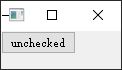
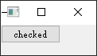
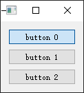
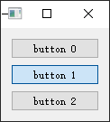
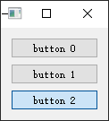
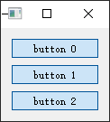

- [Qt Widget-Basic-QAbstractButton](#qt-widget-basic-qabstractbutton)
  - [基本的按钮功能](#基本的按钮功能)
  - [通过 QButtonGroup 实现互斥与批量创建按钮](#通过-qbuttongroup-实现互斥与批量创建按钮)
  - [以上示例改为非互斥](#以上示例改为非互斥)

# Qt Widget-Basic-QAbstractButton

## 基本的按钮功能

`QAbstractButton` 是按钮部件的抽象基类，提供了按钮所共有的功能，这里借助 `QPushButton` 绘制的按钮来介绍该抽象按钮的功能接口

> widget.cpp

```cpp
#include "widget.h"
#include <QApplication>

Widget::Widget(QWidget *parent)
    : QWidget(parent)
{
    m_btn = new QPushButton("unchecked", this);

    connect(m_btn, SIGNAL(clicked()), this, SLOT(onBtnClicked()));
}

Widget::~Widget()
{
    delete m_btn;
}

void Widget::onBtnClicked()
{
    if (m_btn->text() == "unchecked")
    {
        m_btn->setText("checked");
    }
    else
    {
        m_btn->setText("unchecked");
    }
}
```

> widget.h

```cpp
#ifndef WIDGET_H
#define WIDGET_H

#include <QWidget>
#include <QAbstractButton>
#include <QPushButton>

class Widget : public QWidget
{
    Q_OBJECT

public:
    Widget(QWidget *parent = nullptr);
    ~Widget();

private slots:
    void onBtnClicked();

private:
    QAbstractButton *m_btn;
};
#endif // WIDGET_H
```

> main.cpp

```cpp
#include "widget.h"

#include <QApplication>

int main(int argc, char *argv[])
{
    QApplication a(argc, argv);

    Widget w;
    w.show();

    return a.exec();
}
```

  

## 通过 QButtonGroup 实现互斥与批量创建按钮

> widget.cpp

```cpp
#include "widget.h"
#include <QApplication>
#include <QDebug>

Widget::Widget(QWidget *parent)
    : QWidget(parent)
    , m_btnGrp(new QButtonGroup)
    , m_layout(new QVBoxLayout)
{
    m_btnGrp->setExclusive(true);

    for (int i = 0; i < 3; ++i)
    {
        QAbstractButton *btn = new QPushButton;
        btn->setCheckable(true);
        btn->setText(QString("button %1").arg(i));

        m_btnGrp->addButton(btn);
        m_layout->addWidget(btn);
    }

    setLayout(m_layout);

    connect(m_btnGrp, SIGNAL(buttonClicked(QAbstractButton*)), this, SLOT(onBtnClicked(QAbstractButton*)));
}

Widget::~Widget()
{
    QList<QAbstractButton *> list = m_btnGrp->buttons();

    for (int i = 0; i < list.size(); ++i)
    {
        delete list[i];
    }
    delete m_btnGrp;
}

void Widget::onBtnClicked(QAbstractButton *pBtn)
{
    qDebug() << pBtn->text() << " clicked";
}
```

> debug log

```
"button 0"  clicked
"button 1"  clicked
"button 2"  clicked
```

  

## 以上示例改为非互斥

```cpp
m_btnGrp->setExclusive(false);
```

即3个按钮可同时按下


