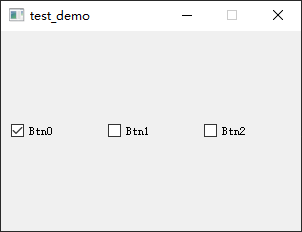

- [Qt Widget-Basic-QCheckBox](#qt-widget-basic-qcheckbox)
  - [基础功能](#基础功能)
  - [使用槽函数监听按键变化](#使用槽函数监听按键变化)
  - [构建 ButtonGroup](#构建-buttongroup)

# Qt Widget-Basic-QCheckBox

## 基础功能

---

构造一个基础的复选框，和一个三态复选框


> widget.cpp

```cpp
#include "widget.h"
#include <QApplication>

Widget::Widget(QWidget *parent)
    : QWidget(parent)
{
    setFixedSize(300, 200);

    m_layout = new QVBoxLayout;
    m_chkbox = new QCheckBox;
    m_chkbox1 = new QCheckBox;

    m_chkbox->setText("check box");

    m_chkbox1->setTristate(true);
    m_chkbox1->setText("tristate");

    m_layout->addWidget(m_chkbox);
    m_layout->addWidget(m_chkbox1);
    setLayout(m_layout);
}

Widget::~Widget()
{
    delete m_chkbox;
    delete m_chkbox1;
    delete m_layout;
}
```

> widget.h

```cpp
#ifndef WIDGET_H
#define WIDGET_H

#include <QWidget>
#include <QVBoxLayout>
#include <QCheckBox>

class Widget : public QWidget
{
    Q_OBJECT

public:
    Widget(QWidget *parent = nullptr);
    ~Widget();

private:
    QCheckBox *m_chkbox, *m_chkbox1, *m_chkbox2;
    QVBoxLayout *m_layout;
};
#endif // WIDGET_H
```

## 使用槽函数监听按键变化

---

> widget.cpp

```cpp
#include "widget.h"
#include <QApplication>

Widget::Widget(QWidget *parent)
    : QWidget(parent)
{
    setFixedSize(300, 200);

    m_layout = new QVBoxLayout;
    m_label = new QLabel;
    m_chkbox = new QCheckBox;

    m_chkbox->setText("tristate check box");
    m_chkbox->setTristate(true);

    m_label->setText("Unchecked");

    m_layout->addWidget(m_chkbox);
    m_layout->addWidget(m_label);

    setLayout(m_layout);
    connect(m_chkbox, SIGNAL(stateChanged(int)), this, SLOT(onStateChanged(int)));
}

Widget::~Widget()
{
    delete m_chkbox;
    delete m_layout;
}

void Widget::onStateChanged(int state)
{
    if (state == Qt::Checked)
    {
        m_label->setText("checked");
    }
    else if (state == Qt::PartiallyChecked)
    {
        m_label->setText("PartiallyChecked");
    }
    else if (state == Qt::Unchecked)
    {
        m_label->setText("Unchecked");
    }
}
```

> widget.h

```cpp
#ifndef WIDGET_H
#define WIDGET_H

#include <QWidget>
#include <QVBoxLayout>
#include <QCheckBox>
#include <QLabel>

class Widget : public QWidget
{
    Q_OBJECT

public:
    Widget(QWidget *parent = nullptr);
    ~Widget();

private slots:
    void onStateChanged(int state);

private:
    QCheckBox *m_chkbox, *m_chkbox1, *m_chkbox2;
    QLabel *m_label;

    QVBoxLayout *m_layout;
};
#endif // WIDGET_H
```

  

## 构建 ButtonGroup

---

> widget.cpp

```cpp
#include "widget.h"
#include <QApplication>
#include <QDebug>

Widget::Widget(QWidget *parent)
    : QWidget(parent)
{
    setFixedSize(300, 200);

    m_layout = new QHBoxLayout();
    m_group = new QButtonGroup(this);

    m_group->setExclusive(false);
    m_chkbox = new QCheckBox("Btn0");
    m_chkbox1 = new QCheckBox("Btn1");
    m_chkbox2 = new QCheckBox("Btn2");

    m_group->addButton(m_chkbox);
    m_group->addButton(m_chkbox1);
    m_group->addButton(m_chkbox2);

    m_layout->addWidget(m_chkbox);
    m_layout->addWidget(m_chkbox1);
    m_layout->addWidget(m_chkbox2);

    m_layout->setContentsMargins(10, 10, 10, 10);
    m_layout->setSpacing(10);

    setLayout(m_layout);

    connect(m_group, SIGNAL(buttonClicked(QAbstractButton *)), this, SLOT(onButtonClicked(QAbstractButton *)));
}

Widget::~Widget()
{
    delete m_chkbox;
    delete m_layout;
}

void Widget::onButtonClicked(QAbstractButton *button)
{
    qDebug() << QString("Clicked Button : %1").arg(button->text());

    QList<QAbstractButton*> list = m_group->buttons();
    foreach (QAbstractButton *btn, list)
    {
        QString strStatus = btn->isChecked() ? "Checked" : "Unchecked";
        qDebug() << QString("Button : %1 is %2").arg(btn->text()).arg(strStatus);
    }
}
```

> widget.h

```cpp
#ifndef WIDGET_H
#define WIDGET_H

#include <QWidget>
#include <QButtonGroup>
#include <QHBoxLayout>
#include <QCheckBox>

class Widget : public QWidget
{
    Q_OBJECT

public:
    Widget(QWidget *parent = nullptr);
    ~Widget();

private slots:
    void onButtonClicked(QAbstractButton *button);

private:
    QButtonGroup *m_group;
    QCheckBox *m_chkbox, *m_chkbox1, *m_chkbox2;

    QHBoxLayout *m_layout;
};
#endif // WIDGET_H
```

> debug log

```
"Clicked Button : Btn0"
"Button : Btn0 is Checked"
"Button : Btn1 is Unchecked"
"Button : Btn2 is Unchecked"
"Clicked Button : Btn1"
"Button : Btn0 is Checked"
"Button : Btn1 is Checked"
"Button : Btn2 is Unchecked"
"Clicked Button : Btn2"
"Button : Btn0 is Checked"
"Button : Btn1 is Checked"
"Button : Btn2 is Checked"
```

 
