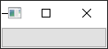
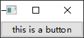
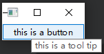
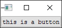
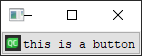
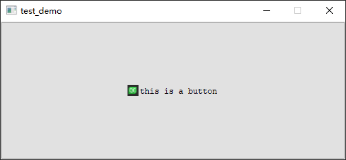
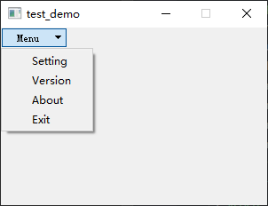

- [Qt Widget-Basic-QPushButton](#qt-widget-basic-qpushbutton)
  - [Main Entry](#main-entry)
  - [Demonstration](#demonstration)

# Qt Widget-Basic-QPushButton

## Main Entry

```cpp
#include <QApplication>

int main(int argc, char *argv[])
{
    QApplication a(argc, argv);

    // add your demo code here

    return a.exec();
}
```

## Demonstration

---

> `#include <QPushButton>`

 **生成一个基本的按键** 

```cpp
QPushButton button;
button.show();
```

 **给按键加上字符串内容** 

```cpp
QPushButton button;
button.setText("this is a button");
button.show();

// or
QPushButton button("this is a button");
button.show();
```

 **给按键加上字符串提示** 

```cpp
button.setToolTip("this is a tool tip");
```

 **给按键设置字体** 

> `#include <QFont>`

```cpp
QFont font("Courier");
button.setFont(font);
```

 **给按键设置icon** 

> `#include <QIcon>`

```cpp
QIcon icon("icon.png");
button.setIcon(icon);
```

 **给按键设置尺寸** 

```cpp
button.setFixedSize(500, 200);
```

 **给按键添加菜单**

> widget.cpp

```cpp
#include "widget.h"
#include <QApplication>

Widget::Widget(QWidget *parent)
    : QWidget(parent)
{
    setFixedSize(300, 200);

    m_btn = new QPushButton(this);
    m_menu = new QMenu(this);

    m_menu->addAction(QString("Setting"));
    m_menu->addAction(QString("Version"));
    m_menu->addAction(QString("About"));
    m_menu->addAction(QString("Exit"));

    m_btn->setText("Menu");
    m_btn->setMenu(m_menu);
}

Widget::~Widget()
{
    delete m_btn;
}

void Widget::onBtnClicked()
{
}
```

```cpp
#ifndef WIDGET_H
#define WIDGET_H

#include <QWidget>
#include <QPushButton>
#include <QMenu>

class Widget : public QWidget
{
    Q_OBJECT

public:
    Widget(QWidget *parent = nullptr);
    ~Widget();

private slots:
    void onBtnClicked();

private:
    QPushButton  *m_btn;
    QMenu *m_menu;
};
#endif // WIDGET_H
```

> main.cpp

```cpp
#include "widget.h"
#include <QApplication>

int main(int argc, char *argv[])
{
    QApplication a(argc, argv);

    Widget w;
    w.show();

    return a.exec();
}
```
