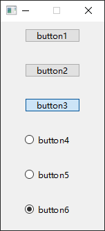
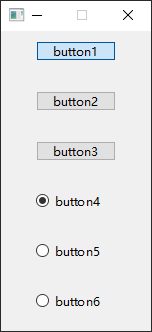

- [Qt Widget-Basic-QRadioButton](#qt-widget-basic-qradiobutton)
  - [Button Group](#button-group)

# Qt Widget-Basic-QRadioButton

## Button Group

> main.cpp

将 `QPushButton` 的 `Checkable` 属性设置为 `true` 后，也可以实现 `QRadioButton` 的功能

```cpp
#include <QApplication>
#include <QWidget>
#include <QPushButton>
#include <QRadioButton>
#include <QButtonGroup>

int main(int argc, char *argv[])
{
    QApplication a(argc, argv);

    QWidget w;
    w.setFixedSize(150, 300);

    QPushButton button1("button1", &w);
    button1.setGeometry(35, 10, 80, 20);
    button1.setCheckable(true);
    QPushButton button2("button2", &w);
    button2.setGeometry(35, 60, 80, 20);
    button2.setCheckable(true);
    QPushButton button3("button3", &w);
    button3.setGeometry(35, 110, 80, 20);
    button3.setCheckable(true);

    QRadioButton button4("button4", &w);
    button4.setGeometry(35, 160, 80, 20);
    QRadioButton button5("button5", &w);
    button5.setGeometry(35, 210, 80, 20);
    QRadioButton button6("button6", &w);
    button6.setGeometry(35, 260, 80, 20);

    QButtonGroup group(&w);
    group.addButton(&button1);
    group.addButton(&button2);
    group.addButton(&button3);

    QButtonGroup group1(&w);
    group1.addButton(&button4);
    group1.addButton(&button5);
    group1.addButton(&button6);

    w.show();

    return a.exec();
}
```

 
