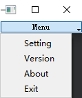
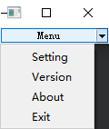
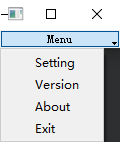
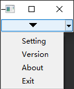
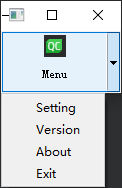

- [Qt Widget-Basic-QToolButton](#qt-widget-basic-qtoolbutton)
  - [菜单](#菜单)
  - [箭头](#箭头)
  - [自定义图标](#自定义图标)

# Qt Widget-Basic-QToolButton

## 菜单

```cpp
QToolButton btn;
QMenu menu;

menu.addAction(QString("Setting"));
menu.addAction(QString("Version"));
menu.addAction(QString("About"));
menu.addAction(QString("Exit"));

btn.setText("Menu");
btn.setMenu(&menu);

// DelayedPopup         长按后显示菜单
// MenuButtonPopup      按下按钮的箭头部分时显示菜单
// InstantPopup         按下工具按钮时菜单显示 按钮自身的动作不触发
m_btn->setPopupMode(QToolButton::InstantPopup);

btn.show();
```

  

## 箭头

```cpp
btn.setArrowType(Qt::DownArrow);
btn.setToolButtonStyle(Qt::ToolButtonIconOnly);
```



## 自定义图标

```cpp
#include <QIcon>
#include <QSize>

btn.setIcon(QIcon("icon.png"));
btn.setIconSize(QSize(40, 40));
btn.setToolButtonStyle(Qt::ToolButtonTextUnderIcon);
```

