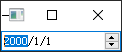
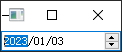

- [Qt Widget-Basic-QDateEdit](#qt-widget-basic-qdateedit)
  - [基础功能](#基础功能)
  - [设置当前日期](#设置当前日期)

# Qt Widget-Basic-QDateEdit

## 基础功能

---

Qt会构造一个默认的日期



```cpp
QDateEdit date;
date.show();
```

## 设置当前日期

---



```cpp
#include <QDateTime>

date.setDisplayFormat("yyyy/MM/dd");
date.setDateTime(QDateTime::currentDateTime());
```

