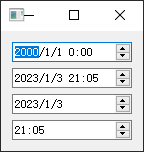
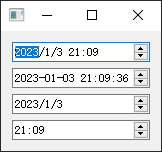
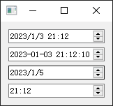
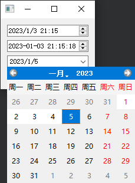

- [Qt Widget-Basic-QDateTimeEdit](#qt-widget-basic-qdatetimeedit)
  - [基础使用](#基础使用)
  - [设定时间和格式](#设定时间和格式)
  - [限定日期范围](#限定日期范围)
  - [弹出日历](#弹出日历)

# Qt Widget-Basic-QDateTimeEdit

## 基础使用

---



```cpp
#include <QDateTimeEdit>
#include <QDate>
#include <QTime>
#include <QDateTime>
#include <QVBoxLayout>

QWidget w;

QDateTimeEdit dt0(&w);
QDateTimeEdit dt1(QDateTime::currentDateTime(), &w);
QDateTimeEdit dt2(QDate::currentDate(), &w);
QDateTimeEdit dt3(QTime::currentTime(), &w);

QVBoxLayout layout(&w);
layout.addWidget(&dt0);
layout.addWidget(&dt1);
layout.addWidget(&dt2);
layout.addWidget(&dt3);

w.show();
```

## 设定时间和格式

---



```cpp
dt0.setDateTime(QDateTime::currentDateTime());
dt1.setDisplayFormat("yyyy-MM-dd HH:mm:ss");
```

## 限定日期范围

---



```cpp
dt2.setMinimumDate(QDate::currentDate().addDays(-2));
dt2.setMaximumDate(QDate::currentDate().addDays(2));
```

## 弹出日历

---

在日期范围限定的基础上弹出日历



```cpp
dt2.setMinimumDate(QDate::currentDate().addDays(-2));
dt2.setMaximumDate(QDate::currentDate().addDays(2));
dt2.setCalendarPopup(true);
```

