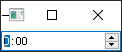
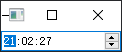

- [Qt Widget-Basic-QTimeEdit](#qt-widget-basic-qtimeedit)
  - [基础功能](#基础功能)
  - [设置当前时间](#设置当前时间)

# Qt Widget-Basic-QTimeEdit

## 基础功能

---



```cpp
QTimeEdit time;
time.show();
```

## 设置当前时间

---



```cpp
#include <QDateTime>

time.setDisplayFormat("HH:mm:ss");
time.setDateTime(QDateTime::currentDateTime());
```
