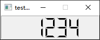
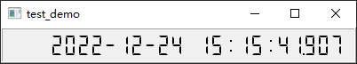

- [Qt Widget-Basic-QLCDNumber](#qt-widget-basic-qlcdnumber)
  - [Basic Display](#basic-display)
  - [Digital Clock](#digital-clock)

# Qt Widget-Basic-QLCDNumber

## Basic Display

> main.cpp

```cpp
QLCDNumber lcd;

lcd.display("1234");
lcd.setFixedSize(200, 50);

lcd.show();
```



## Digital Clock

> widget.cpp

```cpp
#include "widget.h"
#include <QApplication>

Widget::Widget(QWidget *parent)
    : QWidget(parent)
{
    // 构建一个LCD
    m_lcd = new QLCDNumber(this);
    m_lcd->setDigitCount(25);
    m_lcd->setSegmentStyle(QLCDNumber::Flat);
    m_lcd->setSmallDecimalPoint(true);
    m_lcd->setFixedSize(400, 40);

    // 构建一个定时器
    m_timer = new QTimer(this);
    m_timer->setInterval(1000);

    m_timer->start();

    connect(m_timer, SIGNAL(timeout()), this, SLOT(onTimeOut()));
}

Widget::~Widget()
{
    delete m_lcd;
    delete m_timer;
}

void Widget::onTimeOut()
{
    QDateTime date = QDateTime::currentDateTime();
    m_lcd->display(date.toString("yyyy-MM-dd HH:mm:ss.zzz"));
}
```

> widget.h

```cpp
#ifndef WIDGET_H
#define WIDGET_H

#include <QWidget>
#include <QLCDNumber>
#include <QTimer>
#include <QDateTime>

class Widget : public QWidget
{
    Q_OBJECT

public:
    Widget(QWidget *parent = nullptr);
    ~Widget();

private slots:
    void onTimeOut();

private:
    QLCDNumber *m_lcd;
    QTimer *m_timer;
};
#endif // WIDGET_H
```

> main.cpp

```cpp
#include "widget.h"
#include <QApplication>

int main(int argc, char *argv[])
{
    QApplication a(argc, argv);

    Widget w;
    w.show();

    return a.exec();
}
```



