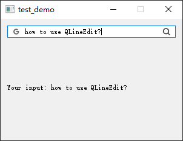

- [Qt Widget-Basic-QLineEdit](#qt-widget-basic-qlineedit)
  - [QLineEdit 的常用回显模式](#qlineedit-的常用回显模式)
  - [实现搜索框](#实现搜索框)
  - [正则匹配输入](#正则匹配输入)
  - [输入掩码](#输入掩码)

# Qt Widget-Basic-QLineEdit

## QLineEdit 的常用回显模式

---

 

> widget.cpp

```cpp
#include "widget.h"
#include <QApplication>
#include <QDebug>

Widget::Widget(QWidget *parent)
    : QWidget(parent)
{
    setFixedSize(300, 200);

    m_layout = new QVBoxLayout(this);

    m_edit0 = new QLineEdit(this);
    m_edit0->setPlaceholderText("Normal");
    m_edit0->setEchoMode(QLineEdit::Normal);
    m_edit1 = new QLineEdit(this);
    m_edit1->setPlaceholderText("NoEcho");
    m_edit1->setEchoMode(QLineEdit::NoEcho);
    m_edit2 = new QLineEdit(this);
    m_edit2->setPlaceholderText("Password");
    m_edit2->setEchoMode(QLineEdit::Password);
    m_edit3 = new QLineEdit(this);
    m_edit3->setPlaceholderText("PasswordEchoOnEdit");
    m_edit3->setEchoMode(QLineEdit::PasswordEchoOnEdit);

    m_layout->addWidget(m_edit0);
    m_layout->addWidget(m_edit1);
    m_layout->addWidget(m_edit2);
    m_layout->addWidget(m_edit3);

    setLayout(m_layout);
}

Widget::~Widget()
{
}
```

> widget.h

```cpp
#ifndef WIDGET_H
#define WIDGET_H

#include <QWidget>
#include <QVBoxLayout>
#include <QCheckBox>
#include <QLineEdit>

class Widget : public QWidget
{
    Q_OBJECT

public:
    Widget(QWidget *parent = nullptr);
    ~Widget();

private slots:

private:
    QLineEdit *m_edit0, *m_edit1, *m_edit2, *m_edit3;
    QVBoxLayout *m_layout;
};
#endif // WIDGET_H
```

## 实现搜索框

---

输入框输入内容后通过回车或者点击右侧的搜索图标，输入框中的内容即可被检测并更新至 `QLabel` 对象中

 

> widget.cpp

```cpp
#include "widget.h"
#include <QApplication>
#include <QDebug>

Widget::Widget(QWidget *parent)
    : QWidget(parent)
{
    setFixedSize(300, 200);

    m_layout = new QVBoxLayout(this);
    m_label = new QLabel("Your input: ", this);

    m_edit = new QLineEdit(this);
    m_edit->setPlaceholderText("Google serach");

    m_edit->addAction(QIcon("google.png"), QLineEdit::LeadingPosition);
    m_action = m_edit->addAction(QIcon("search.png"), QLineEdit::TrailingPosition);

    m_layout->addWidget(m_edit);
    m_layout->addWidget(m_label);

    setLayout(m_layout);

    connect(m_action, SIGNAL(triggered(bool)), this, SLOT(onSearch(bool)));
    connect(m_edit, SIGNAL(editingFinished()), this, SLOT(onSearch()));
}

Widget::~Widget()
{
}

void Widget::onSearch(bool checked)
{
    m_label->setText(QString("Your input: %1").arg(m_edit->text()));
}

void Widget::onSearch()
{
    m_label->setText(QString("Your input: %1").arg(m_edit->text()));
}
```

> widegt.h

```cpp
#ifndef WIDGET_H
#define WIDGET_H

#include <QWidget>

#include <QBoxLayout>
#include <QAction>
#include <QLabel>
#include <QLineEdit>
#include <QIcon>

class Widget : public QWidget
{
    Q_OBJECT

public:
    Widget(QWidget *parent = nullptr);
    ~Widget();

private slots:
    void onSearch(bool);
    void onSearch();

private:
    QLineEdit *m_edit;
    QLabel *m_label;
    QVBoxLayout *m_layout;
    QAction *m_action;
};
#endif // WIDGET_H
```

## 正则匹配输入

---

对用户的输入做一些限制


> widget.cpp

```cpp
#include "widget.h"
#include <QApplication>
#include <QDebug>

Widget::Widget(QWidget *parent)
    : QWidget(parent)
{
    setFixedSize(300, 200);

    m_layout = new QVBoxLayout(this);

    m_edit0 = new QLineEdit(this);
    m_edit0->setPlaceholderText("Integer(1-99)");
    m_edit1 = new QLineEdit(this);
    m_edit1->setPlaceholderText("Float");
    m_edit2 = new QLineEdit(this);
    m_edit2->setPlaceholderText("Letter&Digit");

    QIntValidator *valid_int = new QIntValidator(this);
    valid_int->setRange(1, 99);
    m_edit0->setValidator(valid_int);

    QDoubleValidator *valid_float = new QDoubleValidator(this);
    valid_float->setRange(-360, 360);
    valid_float->setDecimals(2);
    m_edit1->setValidator(valid_float);

    QRegExpValidator *valid_reg = new QRegExpValidator(this);
    valid_reg->setRegExp(QRegExp("[a-zA-Z0-9]+$"));
    m_edit2->setValidator(valid_reg);

    m_layout->addWidget(m_edit0);
    m_layout->addWidget(m_edit1);
    m_layout->addWidget(m_edit2);

    setLayout(m_layout);
}
```

## 输入掩码

---

对于特定格式的输入做限制


```cpp
#include "widget.h"
#include <QApplication>
#include <QDebug>

Widget::Widget(QWidget *parent)
    : QWidget(parent)
{
    setFixedSize(300, 200);

    m_layout = new QVBoxLayout(this);

    m_edit0 = new QLineEdit(this);
    m_edit0->setInputMask("000.000.000.000;_");
    m_edit1 = new QLineEdit(this);
    m_edit1->setInputMask("HH:HH:HH:HH:HH:HH;_");
    m_edit2 = new QLineEdit(this);
    m_edit2->setInputMask("0000-00-00");
    m_edit3 = new QLineEdit(this);
    m_edit3->setInputMask(">AAAAA-AAAAA-AAAAA-AAAAA-AAAAA;#");

    m_layout->addWidget(m_edit0);
    m_layout->addWidget(m_edit1);
    m_layout->addWidget(m_edit2);
    m_layout->addWidget(m_edit3);

    setLayout(m_layout);
}
```