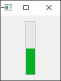

- [Qt Widget-Basic-QProgressBar](#qt-widget-basic-qprogressbar)
  - [基础功能](#基础功能)
  - [使进度条显示繁忙](#使进度条显示繁忙)
  - [纵向显示](#纵向显示)
  - [翻转方向](#翻转方向)
  - [文本显示](#文本显示)

# Qt Widget-Basic-QProgressBar

## 基础功能

---


```cpp
QWidget w;

QProgressBar bar(&w);
bar.setMaximum(100);
bar.setMinimum(0);
bar.setValue(30);
bar.setTextVisible(true);
bar.setOrientation(Qt::Vertical);

QHBoxLayout layout(&w);
layout.addWidget(&bar);

w.show();
```

## 使进度条显示繁忙

---


```cpp
bar.setMaximum(0);
bar.setMinimum(0);
```

## 纵向显示

---



```cpp
bar.setOrientation(Qt::Vertical);
```

## 翻转方向

---


```cpp
QWidget w;

QProgressBar bar(&w);
bar.setMaximum(100);
bar.setMinimum(0);
bar.setValue(50);
bar.setTextVisible(true);
bar.setAlignment(Qt::AlignHCenter);

QProgressBar bar1(&w);
bar1.setMaximum(100);
bar1.setMinimum(0);
bar1.setValue(50);
bar1.setTextVisible(true);
bar1.setInvertedAppearance(true);
bar1.setAlignment(Qt::AlignHCenter);

QVBoxLayout layout(&w);
layout.addWidget(&bar);
layout.addWidget(&bar1);

w.show();
```

## 文本显示

---


```cpp
QWidget w;

QProgressBar bar(&w);
bar.setMaximum(100);
bar.setMinimum(0);
bar.setValue(50);
bar.setFormat(QString("download :%1%").arg(QString::number(bar.value() * 100 / bar.maximum(), 'f', 1)));
bar.setStyleSheet("text-align:right");

QHBoxLayout layout(&w);
layout.addWidget(&bar);

w.show();
```