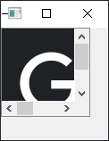

- [Qt Widget-Basic-QScrollArea](#qt-widget-basic-qscrollarea)
  - [基本功能](#基本功能)

# Qt Widget-Basic-QScrollArea

## 基本功能

---



```cpp
QWidget w;

QLabel pic(&w);
pic.setPixmap(QPixmap("img.png"));

QScrollArea area(&w);
area.setBackgroundRole(QPalette::Dark);
area.setWidget(&pic);
area.setFixedSize(100, 100);

w.show();
```