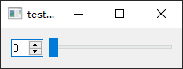
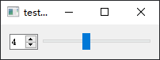
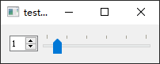

- [Qt Widget-Basic-QSlider](#qt-widget-basic-qslider)
  - [基础功能](#基础功能)
  - [显示刻度](#显示刻度)

# Qt Widget-Basic-QSlider

## 基础功能

---

 

```cpp
#include <QSlider>
#include <QSpinBox>
#include <QHBoxLayout>
#include <QApplication>

int main(int argc, char *argv[])
{
    QApplication a(argc, argv);

    QWidget w;

    QSpinBox box(&w);
    box.setRange(0, 10);
    box.setSingleStep(2);

    QSlider slider(&w);
    slider.setRange(box.minimum(), box.maximum());
    slider.setSingleStep(box.singleStep());
    slider.setOrientation(Qt::Horizontal);
    slider.setValue(0);

    QHBoxLayout layout(&w);
    layout.addWidget(&box);
    layout.addWidget(&slider);

    QWidget::connect(&box, SIGNAL(valueChanged(int)), &slider, SLOT(setValue(int)));
    QWidget::connect(&slider, SIGNAL(valueChanged(int)), &box, SLOT(setValue(int)));

    w.show();

    return a.exec();
}
```

## 显示刻度

---



```cpp
slider.setTickInterval(2);
slider.setTickPosition(QSlider::TicksAbove);
```

