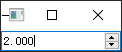
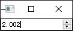

- [Qt Widget-Basic-QDoubleSpinBox](#qt-widget-basic-qdoublespinbox)
  - [基本功能](#基本功能)

# Qt Widget-Basic-QDoubleSpinBox

## 基本功能

 

```cpp
QDoubleSpinBox box;
box.setRange(2, 10);
box.setDecimals(3);
box.setSingleStep(0.002);
box.show();
```
