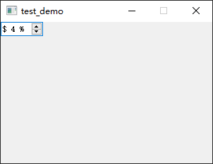
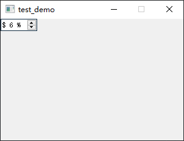
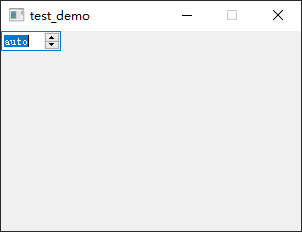

- [Qt Widget-Basic-QSpinBox](#qt-widget-basic-qspinbox)
  - [基本功能](#基本功能)
  - [特殊文本](#特殊文本)

# Qt Widget-Basic-QSpinBox

## 基本功能

---

 

```cpp
QSpinBox *box = new QSpinBox(this);
box->setRange(2, 10);
box->setSingleStep(2);
box->setValue(4);
box->setPrefix("$ ");
box->setSuffix(" %");
box->setWrapping(true); // 循环
```

## 特殊文本

---

只要当前值等于微调框的最小值时，将显示该文本，表明此选择具有特殊（默认）的意思



```cpp
box->setSpecialValueText("auto");
```