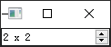

- [Qt Widget-Basic-QSpinBox](#qt-widget-basic-qspinbox)
  - [基本功能](#基本功能)
  - [特殊文本](#特殊文本)
  - [自定义微调格式](#自定义微调格式)

# Qt Widget-Basic-QSpinBox

## 基本功能

---

 

```cpp
QSpinBox *box = new QSpinBox(this);
box->setRange(2, 10);
box->setSingleStep(2);
box->setValue(4);
box->setPrefix("$ ");
box->setSuffix(" %");
box->setWrapping(true); // 循环
```

## 特殊文本

---

只要当前值等于微调框的最小值时，将显示该文本，表明此选择具有特殊（默认）的意思


```cpp
box->setSpecialValueText("auto");
```

## 自定义微调格式

---

自定义一个微调框，允许用户输入特殊的格式

 

> customspinbox.cpp

```cpp

#include "customspinbox.h"
#include <QApplication>

customSpinBox::customSpinBox(QWidget *parent)
{
}
```

> customspinbox.h

```cpp
#ifndef WIDGET_H
#define WIDGET_H

#include <QWidget>
#include <QRegExp>
#include <QSpinBox>

class customSpinBox : public QSpinBox
{
    Q_OBJECT

public:
    customSpinBox(QWidget *parent = nullptr);

protected:
    virtual int valueFromText(const QString &text) const Q_DECL_OVERRIDE
    {
        QRegExp regExp(tr("(\\d+)(\\s*[xx]\\s*\\d+)?"));

        if (regExp.exactMatch(text))
        {
            return regExp.cap(1).toInt();
        }
        else
        {
            return 0;
        }
    }

    virtual QString textFromValue(int value) const Q_DECL_OVERRIDE
    {
        return tr("%1 x %1").arg(value);
    }
};

#endif // WIDGET_H
```

> main.cpp

```cpp
#include "customspinbox.h"
#include <QApplication>

int main(int argc, char *argv[])
{
    QApplication a(argc, argv);

    customSpinBox box;
    box.setRange(2, 10);
    box.setSingleStep(2);
    box.setValue(4);
    box.setWrapping(true);
    box.show();

    return a.exec();
}
```