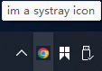
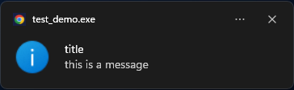
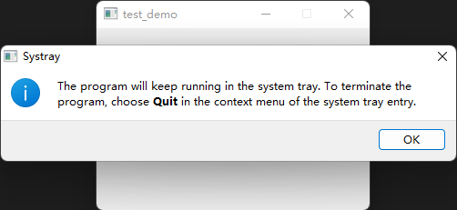

- [Qt Widget-Basic-QSystemTrayIcon](#qt-widget-basic-qsystemtrayicon)
  - [在右下角显示图标和通知](#在右下角显示图标和通知)
  - [关闭程序时保留在后台，通过菜单退出](#关闭程序时保留在后台通过菜单退出)

# Qt Widget-Basic-QSystemTrayIcon

## 在右下角显示图标和通知

 

> traymenu.cpp

```cpp
#include "traymenu.h"
#include <QApplication>

TrayMenu::TrayMenu(QWidget *parent)
    : QMenu(parent)
{
    m_pShowAction = new QAction(QIcon(":/icon/open"), QString::fromLocal8Bit("display"), this);
    m_pSettingAction = new QAction(QIcon(":/icon/setting"), QString::fromLocal8Bit("setting"), this);
    m_pHomePageAction = new QAction(QIcon(":/icon/home"), QString::fromLocal8Bit("login"), this);
    m_pHelpAction= new QAction(QIcon(":/icon/help"), QString::fromLocal8Bit("help"), this);
    m_pAboutAction = new QAction(QIcon(":/icon/about"), QString::fromLocal8Bit("about"), this);
    m_pUpgradeAction = new QAction(QIcon(":/icon/upgrade"), QString::fromLocal8Bit("update"), this);
    m_pQuitAction = new QAction(QIcon(":/icon/quit"), QString::fromLocal8Bit("quit"), this);

    addAction(m_pShowAction);
    addAction(m_pSettingAction);
    addAction(m_pHomePageAction);
    addSeparator();
    addAction(m_pHelpAction);
    addAction(m_pAboutAction);
    addAction(m_pUpgradeAction);
    addSeparator();
    addAction(m_pQuitAction);

    connect(m_pShowAction, SIGNAL(triggered(bool)), this, SIGNAL(showWindow()));
}
```

> traymenu.h

```cpp
#ifndef TRAYMENU_H
#define TRAYMENU_H

#include <QWidget>
#include <QMenu>
#include <QAction>

class TrayMenu : public QMenu
{
    Q_OBJECT

public:
    TrayMenu(QWidget *parent = nullptr);

signals:
    void showWindow();

private:
    QAction *m_pShowAction;
    QAction *m_pSettingAction;
    QAction *m_pHomePageAction;
    QAction *m_pHelpAction;
    QAction *m_pAboutAction;
    QAction *m_pUpgradeAction;
    QAction *m_pQuitAction;
};

#endif // TRAYMENU_H
```

> widget.cpp

```cpp
#include "widget.h"
#include "traymenu.h"
#include <QApplication>
#include <QMessageBox>
#include <QCloseEvent>
#include <QDebug>

Widget::Widget(QWidget *parent)
    : QWidget(parent)
{
    setFixedSize(300, 200);
    QSystemTrayIcon *pSystemTray = new QSystemTrayIcon(this);
    TrayMenu *pTrayMenu = new TrayMenu(this);

    pSystemTray->setContextMenu(pTrayMenu);

    pSystemTray->setToolTip(QString::fromLocal8Bit("im a systray icon"));
    pSystemTray->setIcon(QIcon("icon.png"));

    connect(pTrayMenu, SIGNAL(showWindow()), this, SLOT(showWindow()));
    connect(pSystemTray , SIGNAL(activated(QSystemTrayIcon::ActivationReason)), this, SLOT(onActivated(QSystemTrayIcon::ActivationReason)));

    pSystemTray->show();
    pSystemTray->showMessage(QString::fromLocal8Bit("title"), QString::fromLocal8Bit("this is a message"));
}

void Widget::showWindow()
{
    showNormal();
    raise();
    activateWindow();
}

void Widget::onActivated(QSystemTrayIcon::ActivationReason reason)
{
    switch(reason)
    {
        case QSystemTrayIcon::Trigger:
        {
            showWindow();
            break;
        }
        case QSystemTrayIcon::DoubleClick:
        {
            qDebug() << "DoubleClick";
            break;
        }
        default:
            break;
    }
}
```

> widget.h

```cpp
#ifndef WIDGET_H
#define WIDGET_H

#include <QWidget>
#include <QSystemTrayIcon>

class Widget : public QWidget
{
    Q_OBJECT

public:
    Widget(QWidget *parent = nullptr);

protected:
    void closeEvent(QCloseEvent *event) override;

private slots:
    void showWindow();
    void onActivated(QSystemTrayIcon::ActivationReason reason);
};

#endif
```

> main.cpp

```cpp
#include "widget.h"
#include <QApplication>

int main(int argc, char *argv[])
{
    QApplication a(argc, argv);

    Widget w;
    w.show();

    return a.exec();
}
```

## 关闭程序时保留在后台，通过菜单退出

---



> traymenu.cpp

给菜单连接退出信号

```cpp
connect(m_pQuitAction, SIGNAL(triggered(bool)), QApplication::instance(), SLOT(quit()));
```

重写窗口的退出事件

> widget.cpp

```cpp
void Widget::closeEvent(QCloseEvent *event)
{
    QMessageBox::information(this, tr("Systray"),
                             tr("The program will keep running in the "
                                "system tray. To terminate the program, "
                                "choose <b>Quit</b> in the context menu "
                                "of the system tray entry."));
    hide();
    event->ignore();
}
```

> widget.h

```cpp
protected:
    void closeEvent(QCloseEvent *event) override;
```