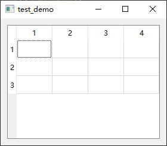

- [Qt Widget-Basic-QTableWidget](#qt-widget-basic-qtablewidget)
  - [基础功能](#基础功能)
  - [均匀拉直表头](#均匀拉直表头)
  - [最后一列填充](#最后一列填充)
  - [打开右键菜单](#打开右键菜单)

# Qt Widget-Basic-QTableWidget

## 基础功能

---


```cpp
QWidget w;

QTableWidget table(4, 3, &w);

QVBoxLayout layout(&w);
layout.addWidget(&table);

w.show();
```

## 均匀拉直表头

---



```cpp
QTableWidget tab(3, 4, &w);
tab.horizontalHeader()->setSectionResizeMode(QHeaderView::Stretch);
```

## 最后一列填充

---


```cpp
QTableWidget tab(3, 4, &w);
tab.horizontalHeader()->setStretchLastSection(true);
```

## 打开右键菜单

---

