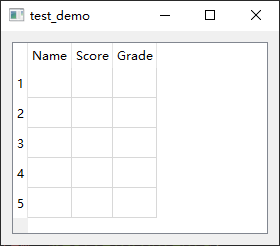
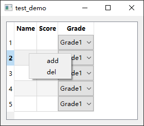

- [Qt Widget-Basic-QTableWidget](#qt-widget-basic-qtablewidget)
  - [基础功能](#基础功能)
  - [列宽控制](#列宽控制)
  - [设置子控件](#设置子控件)
  - [打开右键菜单](#打开右键菜单)

# Qt Widget-Basic-QTableWidget

## 基础功能

---


```cpp
QWidget w;

QTableWidget table(4, 3, &w);

// 设置表格不可编辑
table.setEditTriggers(QAbstractItemView::NoEditTriggers);

QVBoxLayout layout(&w);
layout.addWidget(&table);

w.show();
```


```cpp
// 修改表格行列数
tab.setColumnCount(3);
tab.setRowCount(5);
```


```cpp
// 无焦点虚线框
tab.setFocusPolicy(Qt::NoFocus);
```


```cpp
// 设置水平标题
QStringList header{"Name", "Score", "Grade"};
tab.setHorizontalHeaderLabels(header);
```


```cpp
// 可按下ctrl多选
tab.setSelectionMode(QAbstractItemView::ExtendedSelection);
```


```cpp
// 设置交替背景色
tab.setAlternatingRowColors(true);
```


```cpp
// 不显示表头
tab.horizontalHeader()->setVisible(false);
tab.verticalHeader()->setVisible(false);
```

 

```cpp
// 行选择
tab.setSelectionBehavior(QAbstractItemView::SelectRows);
// 列选择
tab.setSelectionBehavior(QAbstractItemView::SelectColumns);
// 单元格选择
tab.setSelectionBehavior(QAbstractItemView::SelectItems);
```

## 列宽控制

---

自动调整表格的行高和列宽

```cpp
resizeColumnsToContents()：//自动调整所有列的宽度，以适应其内容。
resizeColumnToContents(int column)：//自动调整列号为 co/www 的列的宽度。
resizeRowsToContents()：//自动调整所有行的高度，以适应其内容。
resizeRowToContents(int row)：//自动调整行号为 raw 的行的高度。
```


```cpp
// 手动设置列宽 各模式间冲突 选其一
tab.setColumnWidth(1, 50);
```


```cpp
// 均匀拉伸
tab.horizontalHeader()->setSectionResizeMode(QHeaderView::Stretch);
```



```cpp
// 自适应内容宽度
tab.horizontalHeader()->setSectionResizeMode(QHeaderView::ResizeToContents);
```


```cpp
// 最后一列填充
tab.horizontalHeader()->setStretchLastSection(true);
```

## 设置子控件

---


```cpp
for (int i = 0; i < tab.rowCount(); ++i)
{
    QComboBox *box = new QComboBox(&w);
    box->addItem("Grade1");
    box->addItem("Grade2");
    box->addItem("Grade3");
    tab.setCellWidget(i, 2, box);
}
```

## 打开右键菜单

---



> widget.cpp

```cpp
#include "widget.h"
#include <QApplication>

Widget::Widget(QWidget *parent)
    : QWidget(parent)
{
    tab = new QTableWidget(3, 5, this);
    tab->setAlternatingRowColors(true);
    tab->setSelectionBehavior(QAbstractItemView::SelectRows);

    QStringList header{"Name", "Score", "Grade"};
    tab->setHorizontalHeaderLabels(header);
    tab->horizontalHeader()->setSectionResizeMode(QHeaderView::ResizeToContents);

    for (int i = 0; i < tab->rowCount(); ++i)
    {
        QComboBox *box = new QComboBox(this);
        box->addItem("Grade1");
        box->addItem("Grade2");
        box->addItem("Grade3");
        tab->setCellWidget(i, 2, box);
    }

    tab->setContextMenuPolicy(Qt::CustomContextMenu);

    m_menu = new QMenu(this);
    m_menu->addAction(new QAction("add", m_menu));
    m_menu->addAction(new QAction("del", m_menu));

    connect(tab, SIGNAL(customContextMenuRequested(QPoint)), this, SLOT(onMenuPop(QPoint)));

    QVBoxLayout *layout = new QVBoxLayout(this);
    layout->addWidget(tab);
}

void Widget::onMenuPop(QPoint pos)
{
    QPoint p;
    p.setX(pos.x());
    p.setY(pos.y() + m_menu->height() / 2);
    m_menu->exec(tab->mapToGlobal(p));
}
```

> widget.h

```cpp
#ifndef WIDGET_H
#define WIDGET_H

#include <QWidget>
#include <QTableWidget>
#include <QHeaderView>
#include <QVBoxLayout>
#include <QComboBox>
#include <QMenu>

class Widget : public QWidget
{
    Q_OBJECT

public:
    Widget(QWidget *parent = nullptr);

protected:

private slots:
    void onMenuPop(QPoint pos);

private:
    QMenu *m_menu;
    QTableWidget *tab;
};

#endif
``