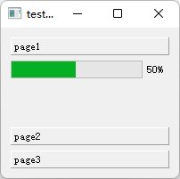
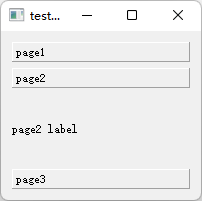
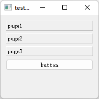

- [Qt Widget-Basic-QToolBox](#qt-widget-basic-qtoolbox)
  - [基础功能](#基础功能)

# Qt Widget-Basic-QToolBox

## 基础功能

---

  

```cpp
QWidget w;

QToolBox box(&w);

QProgressBar bar(&w);
bar.setMaximum(100);
bar.setMinimum(0);
bar.setValue(50);
box.addItem(&bar, "page1");

QLabel lab("page2 label", &w);
box.addItem(&lab, "page2");

QPushButton btn("button", &w);
box.addItem(&btn, "page3");

QVBoxLayout layout(&w);
layout.addWidget(&box);

w.show();
```
