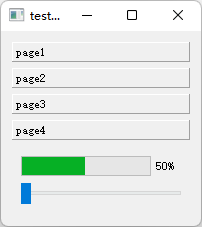

- [Qt Widget-Basic-QToolBox](#qt-widget-basic-qtoolbox)
  - [基础功能](#基础功能)
  - [添加一个页面](#添加一个页面)

# Qt Widget-Basic-QToolBox

## 基础功能

---

  

```cpp
QWidget w;

QToolBox box(&w);

QProgressBar bar(&w);
bar.setMaximum(100);
bar.setMinimum(0);
bar.setValue(50);
box.addItem(&bar, "page1");

QLabel lab("page2 label", &w);
box.addItem(&lab, "page2");

QPushButton btn("button", &w);
box.addItem(&btn, "page3");

QVBoxLayout layout(&w);
layout.addWidget(&box);

w.show();
```

## 添加一个页面

---



```cpp
QWidget page0;
QVBoxLayout layout0(&page0);
QProgressBar bar0(&page0);
QSlider slider0(&page0);

bar0.setRange(0, 100);
bar0.setValue(50);

slider0.setOrientation(Qt::Horizontal);

layout0.addWidget(&bar0);
layout0.addWidget(&slider0);

box.addItem(&page0, "page4");
```