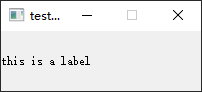
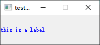
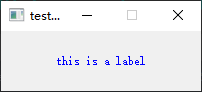
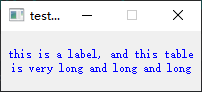
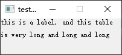
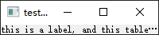
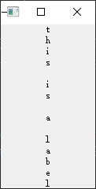
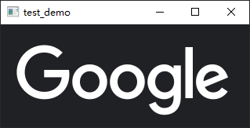
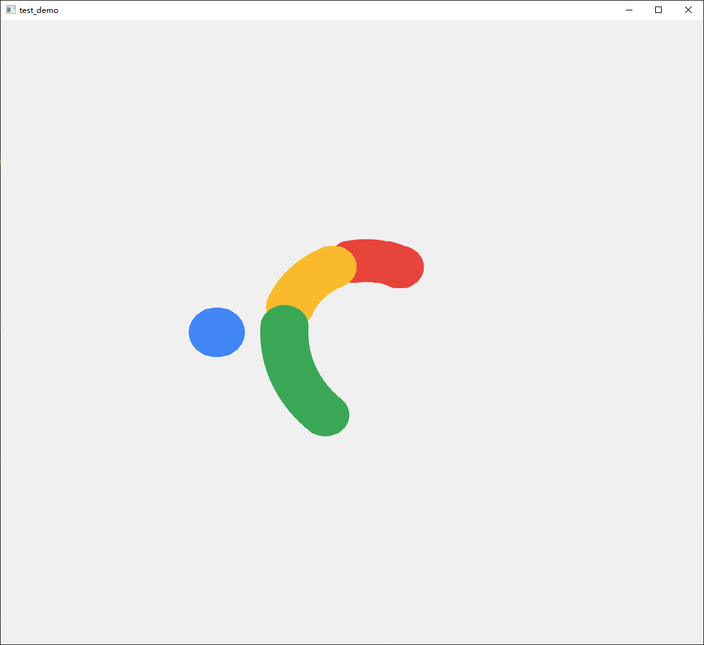

- [Qt Widget-Basic-QLabel](#qt-widget-basic-qlabel)
  - [Basic Label](#basic-label)
  - [StyleSheet](#stylesheet)
  - [Alignment](#alignment)
  - [Wordwrap](#wordwrap)
  - [行高](#行高)
  - [省略](#省略)
  - [纵向显示](#纵向显示)
  - [显示图片](#显示图片)
  - [显示图片](#显示图片-1)

# Qt Widget-Basic-QLabel

## Basic Label

> main.cpp

```cpp
#include <QApplication>
#include <QLabel>

int main(int argc, char *argv[])
{
    QApplication a(argc, argv);

    QLabel label("this is a label");
    label.setFixedSize(200, 60);
    label.show();

    return a.exec();
}
```



## StyleSheet

```cpp
label.setStyleSheet("color: blue");
```



## Alignment

```cpp
label.setStyleSheet("color: blue");
```



## Wordwrap

```cpp
QLabel label("this is a label, and this table is very long and long and long");
label.setFixedSize(200, 60);
label.setStyleSheet("color: blue");
label.setAlignment(Qt::AlignCenter);
label.setWordWrap(true);
label.show();
```



## 行高

```cpp
QLabel label("this is a label, and this table is very long and long and long");
label.setFixedSize(200, 60);
label.setWordWrap(true);

QString strHeightText("<p style=\"line-height:%1%\">%2<p>");
strHeightText = strHeightText.arg(150).arg(label.text());
label.setText(strHeightText);
```



## 省略

```cpp
QLabel label;
QString strText("this is a label, and this table is very long and long and long");
QString strElidedText = label.fontMetrics().elidedText(strText, Qt::ElideRight, 200, Qt::TextShowMnemonic);

label.setText(strElidedText);
label.show();
```



## 纵向显示

```cpp
QLabel label;
QString strText("this is a label");

label.setText(strText.split("", Qt::SplitBehavior::enum_type::SkipEmptyParts).join("\n"));
label.setAlignment(Qt::AlignCenter);
label.show();
```



## 显示图片

> `#include <QPixmap>`

```cpp
QPixmap pixmap("img.png");
QLabel label;

label.setPixmap(pixmap);
// 图片大小自适应
label.setScaledContents(true);
label.show();
```



## 显示图片

> `#include <QMovie>`

```cpp
QLabel label;
QMovie movie("google.gif");

label.setMovie(&movie);
label.setScaledContents(true);

movie.start();
label.show();
```




