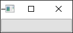
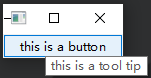
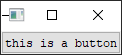
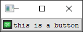
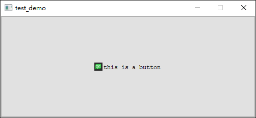

# Qt Widget-Basic-QPushButton

- [Qt Widget-Basic-QPushButton](#qt-widget-basic-qpushbutton)
  - [Main Entry](#main-entry)
  - [Demonstration](#demonstration)


## Main Entry

```cpp
#include <QApplication>

int main(int argc, char *argv[])
{
    QApplication a(argc, argv);

    // add your demo code here

    return a.exec();
}
```

## Demonstration

---

> `#include <QPushButton>`

 **生成一个基本的按键** 

```cpp
QPushButton button;
button.show();
```

 **给按键加上字符串内容** 

```cpp
QPushButton button;
button.setText("this is a button");
button.show();

// or
QPushButton button("this is a button");
button.show();
```

 **给按键加上字符串提示** 

```cpp
button.setToolTip("this is a tool tip");
```

 **给按键设置字体** 

> `#include <QFont>`

```cpp
QFont font("Courier");
button.setFont(font);
```

 **给按键设置icon** 

> `#include <QIcon>`

```cpp
QIcon icon("icon.png");
button.setIcon(icon);
```

 **给按键设置尺寸** 

```cpp
button.setFixedSize(500, 200);
```
