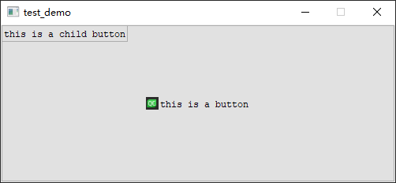

# Qt Parenting System

- [Qt Parenting System](#qt-parenting-system)


以一个PushButton为父对象建立一个PushButton

```cpp
QPushButton button0("this is a button");
QPushButton button1("this is a child button", &button0);

// 将父button尺寸扩大，便于观察
button0.setFixedSize(500, 200);

button0.show();
```



---

