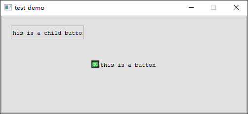

# Qt Layout-System

- [Qt Layout-System](#qt-layout-system)
  - [Set Geometry](#set-geometry)

## Set Geometry

> void QWidget::setGeometry(int x, int y, int w, int h)

如果在控件中加上了layout布局，就不能使用 `setGeometry` 函数，这是因为布局已经被 `layout` 管理

父控件被 `layout` 管理，父控件的子控件却没有，子控件可以使用 `setGeometry` 函数自由的调整位置，但是只能在父控件的范围内调整位置

```cpp
QPushButton button0("this is a button");
QPushButton button1("this is a child button", &button0);

button0.setFixedSize(500, 200);
button1.setGeometry(20, 20, 150, 30);

button0.show();
```



---