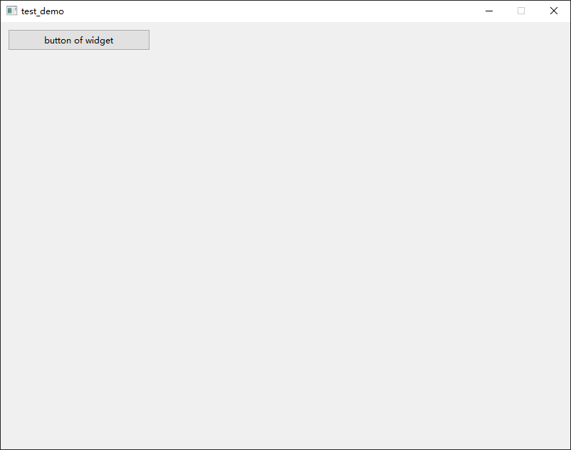

# Qt Widget-SubClassing

## Widget

> widget.h

```
#ifndef WIDGET_H
#define WIDGET_H

#include <QWidget>
#include <QPushButton>

class Widget : public QWidget
{
    Q_OBJECT

public:
    Widget(QWidget *parent = nullptr);
    ~Widget();

private:
    QPushButton *m_btn;
};
#endif // WIDGET_H
```

> widget.cpp

```
#include "widget.h"

Widget::Widget(QWidget *parent)
    : QWidget(parent)
{
    setFixedSize(800, 600);

    m_btn = new QPushButton("button of widget", this);
    m_btn->setGeometry(10, 10, 200, 30);
}

Widget::~Widget()
{
    delete m_btn;
}
```

## Main

> main.cpp

```
#include "widget.h"

#include <QApplication>

int main(int argc, char *argv[])
{
    QApplication a(argc, argv);

    Widget w;
    w.show();

    return a.exec();
}
```



