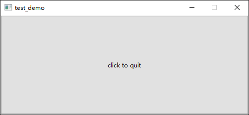
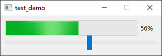
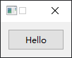
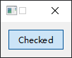

- [Qt Signal-Slot-System](#qt-signal-slot-system)
  - [给按钮添加一个退出的操作](#给按钮添加一个退出的操作)
  - [从Slider传递数值到ProgressBar](#从slider传递数值到progressbar)
  - [自定义Slot函数](#自定义slot函数)

# Qt Signal-Slot-System

## 给按钮添加一个退出的操作

```cpp
#include <QApplication>
#include <QPushButton>

int main(int argc, char *argv[])
{
    QApplication a(argc, argv);

    QPushButton button("click to quit");
    button.setFixedSize(500, 200);

    QObject::connect(
        &button, SIGNAL(clicked()),
        &a, SLOT(quit())
    );

    // or
    // QObject::connect(
    //     &button, SIGNAL(clicked()),
    //     QApplication::instance(), SLOT(quit())
    // );

    button.show();

    return a.exec();
}
```



---

## 从Slider传递数值到ProgressBar

```cpp
#include "widget.h"

#include <QApplication>
#include <QProgressBar>
#include <QSlider>

int main(int argc, char *argv[])
{
    QApplication a(argc, argv);

    Widget w;
    w.setFixedSize(320, 80);

    QProgressBar progressbar(&w);
    progressbar.setRange(0, 100);
    progressbar.setValue(0);
    progressbar.setGeometry(10, 10, 300, 30);

    QSlider slider(&w);
    slider.setOrientation(Qt::Horizontal);
    slider.setRange(0, 100);
    slider.setValue(0);
    slider.setGeometry(10, 40, 300, 30);

    QObject::connect(&slider, SIGNAL(valueChanged(int)), &progressbar, SLOT(setValue(int)));

    w.show();

    return a.exec();
}
```



## 自定义Slot函数

> widget.cpp

```cpp
#include "widget.h"

Widget::Widget(QWidget *parent)
    : QWidget(parent)
{
    setFixedSize(100, 50);

    m_btn = new QPushButton("Hello", this);
    m_btn->setCheckable(true);
    m_btn->setGeometry(10, 10, 80, 30);

    connect(m_btn, SIGNAL(clicked(bool)), this, SLOT(onButtonClicked(bool)));
}

Widget::~Widget()
{
    delete m_btn;
}

void Widget::onButtonClicked(bool checked)
{
    if (checked)
    {
        m_btn->setText("Checked");
    }
    else
    {
        m_btn->setText("Hello");
    }
}
```

> widget.h

```cpp
#ifndef WIDGET_H
#define WIDGET_H

#include <QWidget>
#include <QPushButton>

class Widget : public QWidget
{
    Q_OBJECT

public:
    Widget(QWidget *parent = nullptr);
    ~Widget();

private slots:
    void onButtonClicked(bool checked);

private:
    QPushButton *m_btn;
};
#endif // WIDGET_H
```

> main.cpp

```cpp
#include "widget.h"
#include <QApplication>

int main(int argc, char *argv[])
{
    QApplication a(argc, argv);

    Widget w;
    w.show();

    return a.exec();
}
```

 

